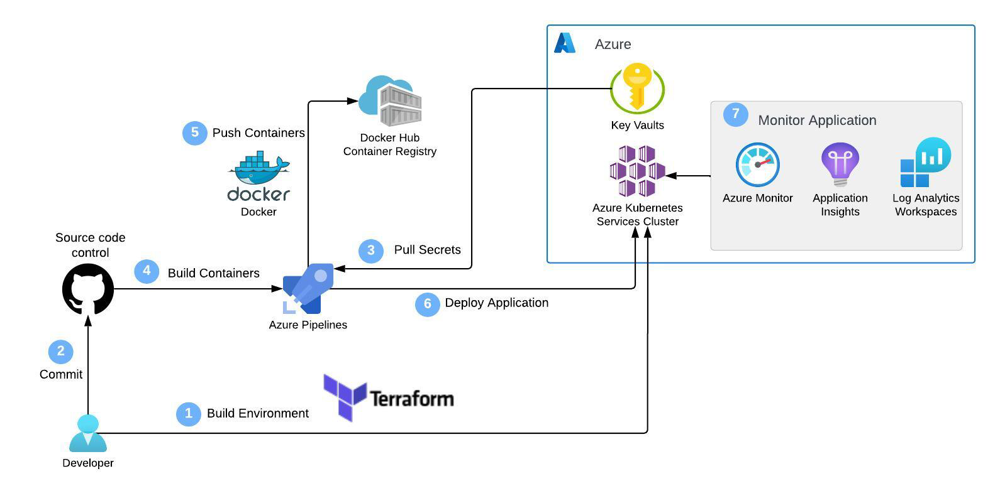

# Web-App-DevOps-Project

Welcome to the Web App DevOps Project repo! The purpose of this repo is to showcase the development of an Azure End-to-End DevOps Pipeline to build and manage a Python Flask application. The application allows efficient management and tracking of orders for a business. It provides an intuitive user interface for viewing existing orders and adding new ones.

## Disclaimer

Needless to say, the processes and technologies used here are overkill for the simplicity of the application and does not represent a typical implementation in industry. Nonetheless, it serves as a learning exercise for the use of the toolsets involved.

In addition, the application is an internal business application, and therefore it is not expected to receive external customer traffic from the internet. Where this is required, you may need to implement usage of a load balancer or ingress, which is outside the scope of this project.

Lastly, whilst the application code isn't the main focus of this project, it determines the requirements for the infrastructure and DevOps workflow being implemented, which in this case is a standard Build, Push and Deploy.

## Table of Contents

- [Features](#features)
- [Prerequisites](#prerequisites)
- [Usage](#usage)
- [Containerisation Process](#containerisation-process)
- [Build](#build)
- [Deploy](#deploy)
- [Access](#access)
- [Azure Kubernetes Service](#azure-kubernetes-service-aks)
- [Azure DevOps and CI/CD](#azure-devops-and-cicd)
- [AKS Cluster Monitoring](#aks-cluster-monitoring)
- [Azure Key Vault](#azure-key-vault)
- [Technology Stack](#technology-stack)
- [Architecture](#architecture)
- [Contributors](#contributors)
- [License](#license)

## Features

- **Order List:** View a comprehensive list of orders including details like date UUID, user ID, card number, store code, product code, product quantity, order date, and shipping date.
  

- **Pagination:** Easily navigate through multiple pages of orders using the built-in pagination feature.
  

- **Add New Order:** Fill out a user-friendly form to add new orders to the system with necessary information.
  

- **Data Validation:** Ensure data accuracy and completeness with required fields, date restrictions, and card number validation.

### Enhancements

- **Adding a Delivery Date Column to Order List:**

   <table style="border-style:solid;border-width:thin;border-left-width:thick;">
   <tr><th>📝 NOTE</th></tr>
   <tr><td>This feature was requested and then reverted. See <a href="https://github.com/sameem97/Web-App-DevOps-Project/issues/1">issue #1</a></td></tr> 
   </table>

- 

  
If requested again, follow these instructions:

  1.  In `app.py` modify the following:

      a. `Order` class to include `delivery_date = Column('Delivery Date', DateTime)`

      b. `@app.route` `add_order` function to include `delivery_date = request.form['delivery_date']`

      c. `new_order` object to include `delivery_date=delivery_date`

  2.  In `order.html` modify the following:

      a. `<th>` elements to include `<th>Delivery Date</th>`

      b. `<td>` elements to include `<td>{{ order.delivery_date }}</td>`

      c. `<form>` element to include `<label for="delivery_date">Delivery Date:</label>` and `<input type="date" id="delivery_date" name="delivery_date">  `

  

  <a href="#readme-top">back to top</a>

### Prerequisites

The preferred method for running this application is via Docker. The benefit of using Docker is the application can be deployed in different environments without the risk of dependency or OS issues. The only prerequisite to running the application on a new instance is the installation of Docker.

### Usage

The simplest way to deploy this application on a given instance is by pulling down the image from DockerHub using this command: `docker pull sameem97/flask-track-orders:latest`. Alternatively you can build the image using the Dockerfile (see Containerisation Process and Build). In either case, you will then need to run the image (see Deploy below) which creates a new instance of a container hosting the application.

### Containerisation Process

The containerisation process starts with the Dockerfile. It can be thought of as a recipe for building the Docker image and handles the installation of Python packages (see requirements.txt) and system dependencies, configuration of environment variables and exposing network ports. The image, like a standardised shipping container, contains everything required to run the application.

### Build

- To build the docker image from the Dockerfile, run this command in the root of the working directory: `docker build -t <image_name> .` where `<image_name>` is the name you would like to give the new image.

### Deploy

- To run the docker image on your instance, you can run the command: `docker run -p 5000:5000 <image_name>` where `-p 5000:5000` is a port mapping between the host machine port 5000 to the container port 5000 as exposed in the Dockerfile and `<image_name>` is the name of the docker image as provided in the build stage. Please note, the optional `-d` flag can be added to run the application in detached mode. Otherwise `ctrl+c` will stop the container.

### Access

To application can be accessed via localhost port 5000: `http://127.0.0.1:5000`. Here you would be met with the following two pages:

1. **Order List Page:** Navigate to the "Order List" page to view all existing orders. Use the pagination controls to navigate between pages.

2. **Add New Order Page:** Click on the "Add New Order" tab to access the order form. Complete all required fields and ensure that your entries meet the specified criteria.

### Azure Kubernetes Service (AKS)

I've utilised a managed Kubernetes cluster hosted by Azure (AKS) as the deployment environment for the application. The benefits of using AKS include improved reliability and scalabaility.

I have utilised Terraform Infrastructure as Code (IaC) with the  Azure resource manager provider, to provision the cluster as well as the required networking infrastructure. See `aks-terraform` folder for modules and usage instructions.

In order to deploy the image to the cluster, I've described the target state of the cluster using k8s-manifests which provisions the necessary resource types to manage the application. This includes a Deployment with 3 replicas and a ClusterIP service allowing internal cluster communications.

The update strategy is a rolling update, allowing a maximum of one pod to be unavailable, minimising downtime during upgrades e.g. updated docker image.

### Azure DevOps and CI/CD

Azure DevOps is an end to end development platform providing various functionality from repository hosting and version control to task tracking and other project management capabilities.

One of its most well known features is its robust CI/CD pipelines; I have utilised a build pipeline with a buildAndPush task to automate the docker image build upon commits to the main branch and pushing this new image into DockerHub. The release pipeline subsequently utilises a Deploy to Kubernetes task to pull down this new image from DockerHub and deploy it to the aks-cluster.

Whilst I haven't added testing to the CI stage yet (I have been testing the application manually), CD is only triggered upon a successful build and passing of the tests. In this manner, CI/CD is an enabler for developers to ship software to users much faster, receiving feedback early if tests fail so that they can iterate rapidly and with confidence.

### AKS Cluster Monitoring

Azure Monitor is a comprehensive monitoring and management solution provided by Azure. It consists of several core components which I have utilised:

- Container Insights: Specifically designed for AKS, provides real-time in-depth insight into containerised workloads.
  
- Metrics Explorer: I've created several custom charts (see screenshows below) to visualise numeric data including: average Node CPU Usage, Average Pod Count, Used Disk Pecentage and Bytes Read and Written per Second. Keeping an eye on vital cluster resources through such time series charts is pivotal for the reliable and efficient operation of the cluster. The charts also allow easy analysis of trends e.g. spike in traffic, how does that affect cluster CPU usage?
  
- Log Analytics: Provides a centralised platform for writing, testing and executing log queries. Compared to metrics, logs provide a deeper insight into historical data generated by various Azure resources. Whilst the SQL-like queries can become quite complex, my basic analysis needs were fulfiled by the example queries which served as a simple starting point and could be edited as required. One example of a query I ran was finding a warning value in the container logs, which would help me proactively search for issues in the containers. Another query I ran monitored kubernetes events e.g. pod scheduling, scaling activities and errors, all essential for tracking the health and stability of the cluster.
  
- Alerts: Used to set up custom notifications based on specified conditions, allowing for proactive responses to potential issues. I set up alerts for CPU usage percentage, Memory Working Set Percentage and Disk Used Percentage. The alerts would be triggered when a threshold usage is exceeded e.g. 80%. Advanced actions can be configured in response to the condition. However, once again due to the simplicity of this project, I configured a simple email notification to the cluster admin, allowing freedom in how to deal with the potential issue.

### Azure Key Vault

- Azure Key Vault is a secrets management tool and is used for the secure storage and retrieval of database connection credentials. Authentication has been provided via RBAC and Managed Identities such that only applications deployed in the cluster have access to the vault.

## Technology Stack

- **Backend:** Flask is used to build the backend of the application, handling routing, data processing, and interactions with the database.

- **Frontend:** The user interface is designed using HTML, CSS, and JavaScript to ensure a smooth and intuitive user experience.

- **Database:** The application employs an Azure SQL Database as its database system to store order-related data.

- **Containerisation:** Docker is used as the containerisation platform. The image is available for access in DockerHub under sameem97/flask-track-orders.

- **IaC:** Terraform is used to provision the AKS cluster and the necessary networking infrastructure, as the target environment for the deployment of the application.

- **Deployment:** The application is deployed in an AKS cluster, the benefits of which include improved availability and scalability.

- **CI/CD:** Azure Pipelines as part of Azure DevOps is utilised for CI/CD, allowing automated build, test and deploy so developers can ship updates to users more quickly and with confidence.

- **Monitoring:** Azure Monitor is used as a comprehensive monitoring solution for the cluster.

- **Secrets Manager:** Azure Key Vault is used for secure management of database connection credentials.

## Architecture

The final architecture is shown by the UML diagram below:

## Contributors

- [Maya Iuga]([https://github.com/yourusername](https://github.com/maya-a-iuga))

## License

This project is licensed under the MIT License. For more details, refer to the [LICENSE](LICENSE) file.
