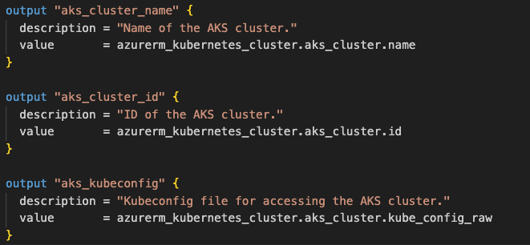

<a id="readme-top"></a>

# Web-App-DevOps-Project

Welcome to the Web App DevOps Project repo! The purpose of this repo is to showcase the development of an Azure End-to-End DevOps Pipeline to build and manage a Python Flask web application. The application allows efficient management and tracking of orders for a business. It provides an intuitive user interface for viewing existing orders and adding new ones.

## Disclaimer

Please note, the processes and technologies used here are overkill for the simplicity of the application and does not represent a typical implementation in industry. Nonetheless, it serves as a learning exercise for the use of the toolsets involved.

In addition, the application is for internal business use, and therefore it is not expected to receive external customer traffic from the internet. Where this is required, you may need to implement usage of a load balancer or ingress, which is outside the scope of this project.

Lastly, whilst the application code isn't the main focus of this project (repository forked from [Maya Iuga](https://github.com/maya-a-iuga)), it determines the requirements for the infrastructure and DevOps workflow being implemented, which in this case is a standard Build, Push and Deploy.

## Table of Contents

- [Architecture](#architecture)
- [Technology Stack](#technology-stack)
- [Application Features](#application-features)
- [Version Control](#version-control)
- [Containerisation Process](#containerisation-process)
  - [Build](#build)
  - [Deploy](#deploy)
  - [Access](#access)
- [Container Orchestration using Kubernetes](#container-orchestration-using-kubernetes)
- [Infrastructure as Code using Terraform](#infrastructure-as-code-using-terraform)
  - [Networking Module](#networking-module)
  - [AKS Cluster Module](#aks-cluster-module)
  - [Creating an AKS Cluster Using Terraform IaC](#creating-an-aks-cluster-using-terraform-iac)
- [Kubernetes Deployment to AKS](#kubernetes-deployment-to-aks)
- [CI/CD using Azure DevOps](#cicd-using-azure-devops)
- [Cluster Monitoring using Azure Monitor](#cluster-monitoring-using-azure-monitor)
- [Secrets Management using Azure Key Vault](#secrets-management-using-azure-key-vault)
- [Contributors](#contributors)
- [License](#license)

## Architecture

A high level view of the architecture is shown by the UML diagram below:


## Technology Stack

- **Backend:** Flask is used to build the backend of the application, handling routing, data processing, and interactions with the database.

- **Frontend:** The user interface is designed using HTML, CSS, and JavaScript to ensure a smooth and intuitive user experience.

- **Database:** The application employs an Azure SQL Database as its database system to store order-related data.

- **Version Control:** Git is used for version control purposes.

- **Repositories:** GitHub is used as a remote repository for the source code. DockerHub is used similarly to host the application docker image.

- **Containerisation:** Docker is used as the containerisation platform. The image is available for access in DockerHub under sameem97/flask-track-orders.

- **Container Orchestration:** The application is deployed in an AKS cluster, the benefits of which include improved availability and scalability.

- **IaC:** Terraform is used to provision the resources in Azure Cloud, including the AKS cluster and the necessary networking infrastructure.

- **CI/CD:** Azure Pipelines as part of Azure DevOps is utilised for CI/CD, allowing automated build, push and deploy so developers can ship updates to users more quickly and consistently.

- **Monitoring:** Azure Monitor is used as a comprehensive monitoring solution for the cluster.

- **Secrets Manager:** Azure Key Vault is used for secure management of database connection credentials.

## Application Features

**Order List:** View a comprehensive list of orders including details like date UUID, user ID, card number, store code, product code, product quantity, order date, and shipping date.

-   <details>
    <summary>Order List</summary>

    
  
    </details>

**Pagination:** Easily navigate through multiple pages of orders using the built-in pagination feature.

-   <details>
    <summary>Pagination</summary>

    

    </details>

**Add New Order:** Fill out a user-friendly form to add new orders to the system with necessary information.

-   <details>
    <summary>Add New Order</summary>

    

    </details>

**Data Validation:** Ensure data accuracy and completeness with required fields, date restrictions, and card number validation.

-   <details>
    <summary>Data Validation</summary>

    

    </details>

### Enhancements

- **Adding a Delivery Date Column to Order List:**

   <table style="border-style:solid;border-width:thin;border-left-width:thick;">
   <tr><th>📝 NOTE</th></tr>
   <tr><td>This feature was requested and then reverted. See <a href="https://github.com/sameem97/Web-App-DevOps-Project/issues/1">issue #1</a></td></tr> 
   </table>

- <details>
  <summary>If requested again, follow these instructions:</summary>

  1.  In `app.py` modify the following:

      a. `Order` class to include `delivery_date = Column('Delivery Date', DateTime)`

      b. `@app.route` `add_order` function to include `delivery_date = request.form['delivery_date']`

      c. `new_order` object to include `delivery_date=delivery_date`

  2.  In `order.html` modify the following:

      a. `<th>` elements to include `<th>Delivery Date</th>`

      b. `<td>` elements to include `<td>{{ order.delivery_date }}</td>`

      c. `<form>` element to include `<label for="delivery_date">Delivery Date:</label>` and `<input type="date" id="delivery_date" name="delivery_date"><br><br>`

  </details>

<p>
  <a href="#readme-top">back to top</a>
</p>

## Version Control

Git is an open-sourcd distributed version control system that allows developers to track, manage and collaborate on code changes efficiently in a decentralised manner. It is the most commonly used version control system in the world.

Git allows the use of parallel branches for development and the creation of regular save points known as commits. These commits serve as a snapshot of the codebase and allows developers to revisit that specific version of the code by referring to the commit ID.

There are many ways to develop using Git. Due to the simplicity of this project, I am following a feature branching strategy where I will typically create a separate branch solely for the development of a specific feature. This will later be merged back into the main branch following testing and peer review.

## Containerisation Process

### Docker

Docker is used as the containerisation platform for building and deploying the application. The benefit of using Docker is the application can be deployed in different environments without the risk of dependency or OS issues. The only prerequisite to deploying the application on a new instance is the installation of Docker.

### Build

The containerisation process starts with the Dockerfile. It can be thought of as a recipe for building the Docker image and handles the installation of Python packages (see requirements.txt) and system dependencies, configuration of environment variables and the exposing of network ports. The image, like a standardised shipping container, contains everything required to run the application.

To build the docker image from the Dockerfile, run this command in the root of the working directory:

```sh
docker build -t <image_name> .
```

where `<image_name>` is the name you would like to give the new image.

### Deploy

To run the docker image in a new container on your instance, you can run the command:

```sh
docker run -p 5000:5000 <image_name>
```

where `-p 5000:5000` is a port mapping between the host machine port 5000 to the container port 5000 as exposed in the Dockerfile and `<image_name>` is the name of the docker image, as the artifact of the build stage. If the image is not available on the instance, then it will be pulled down from DockerHub. In addition, the optional `-d` flag can be added to this command to run the application in detached mode. Otherwise `ctrl+c` will stop the container.


### Access

The application can be accessed via localhost port 5000 as follows:

```sh
http://127.0.0.1:5000
```

Here you would be met with the following two pages:

1. **Order List Page:** Navigate to the "Order List" page to view all existing orders. Use the pagination controls to navigate between pages.

2. **Add New Order Page:** Click on the "Add New Order" tab to access the order form. Complete all required fields and ensure that your entries meet the specified criteria.

## Container Orchestration using Kubernetes

Kubernetes is a container orchestration tool which automates the task of managing containerised applications. Features include:

- Multi-container deployments across a cluster. Users can choose which and how many containers should be deployed, also specifying container replicas for fault tolerance.

- Self-healing: if a pod (usually an instance of the application running multiple containers) goes down, kubernetes spins up a replacement.

- Autoscaling: can use Horizontal Pod Autoscaler (HPA) to scale the number of pod replicas to meet changing demands. Alternatively, can use Vertical Pod Autoscaler (VPA) to scale the physical resources allocated to pods, such as CPU and RAM.

- Load Balancing: can distribute traffic amongst several worker nodes to ensure high availability and efficient resource utilisation.

- Storage Orchestration: can mount storage volumes, whether specific to a node, shared across multiple nodes or of another type. This ensures that the application can save and retrieve data reliably.

Architecture as below:


Overall, kubernetes contains many built-in commands for deploying applications, rolling out changes to applications and scaling applications to meet changing demands, monitoring applications and more. So there are lots of benefits to using a kubernetes deployment environment. In this project, an Azure managed kubernetes cluster is used which further reduces complexity as Azure manages various aspects of the cluster such as the control plane and the provisioning of worker machines (Azure VMs in a Node Pool).

## Infrastructure as Code using Terraform

Terraform is a prominent Infrastructure as Code (IaC) tool in the realm of modern infrastructure management. It is used here to provision and manage the Azure Kubernetes Service (AKS) cluster and the necessary networking infrastructure.

Azure Resource Manager provider using a Service Principal managed identity with RBAC role `contributor`, is used for authentication and configuration of resources in Azure Cloud. This is configured in the root of the aks-terraform project in main.tf.

The project is broken into two terraform modules: a networking-module and an aks-cluster-module.

### Networking Module

This module provisions the necessary networking resources required for the cluster, as defined in main.tf:


As shown above, the resources include:

- Resource Group `Networking`: Container for storing the networking related resources.
- Virtual Network (VNet) `aks-vnet`: Network foundation for the cluster. Follows CIDR notation, defining /16 subnet mask. Part of the VNet address space is broken into the Control Plane subnet and Worker Node subnet.
- Control Plane Subnet `control-plane subnet`: Subnet for cluster control plane, /24 subnet mask.
- Worker Node Subnet `worker-node-subnet`: Subnet for cluster worker nodes (Azure VMs), /24 subnet mask.
- Network Security Group `aks-nsg`: Container for storing network security (firewall) rules controlling access to the kube-apiserver.
- HTTPS Network Security Rule `allow-https`: Allows inbound HTTP traffic (TCP/443) from the local machine public IP address.
- SSH Network Security Rule `allow-ssh`: Allows inbound SSH access (TCP/22) from the local machine public IP address.

#### Defining the input variables for the networking module

The variables.tf file defines the input variables used within the module. Each variable has a description, type and potentially a default value. These variables are configured as environment variables in the shell start up file.


#### Defining the outputs from the networking module

The outputs.tf file is where the module outputs are defined. Each output has a description and a value, and will be utilised by the aks-cluster module.


Once everything has been defined, run the following whilst in the networking-module directory:

  ```sh
  terraform init
  ```

This will initialise the module.

### AKS Cluster Module

This module sets up the AKS cluster resource. It uses outputs from the adjacent networking module to specify the required networking infrastructure.

- Kubernetes Cluster `aks_cluster`: The Azure managed kubernetes cluster where the application will be deployed.


The cluster attributes include:

- name - The cluster name.
- location - The Azure region for the cluster.
- resource_group_name - The name of the resource group to store the cluster.
- dns_prefix - The prefix to the cluster domain name.
- kubernetes_version - Which version of kubernetes the cluster will be using.
- default_node_pool:
  - name - name of the node pool.
  - node_count - how many nodes are in the node pool.
  - vm_size - the size of the virtual machine.
  - enable_auto_scaling - True or False to enable auto scaling of the cluster.
  - min_count - minimum node count for the cluster.
  - max_count - maximum node count for the cluster.
- service_principal:
  - client_id - the client id used to manage the cluster.
  - client_secret - the client secret used to control access to the cluster.

#### Defining the input variables for the AKS Cluster module

The variables.tf file defines the input variables used within the module. Some variables are newly defined, with a description, type and potentially a default value. These variables are configured as environment variables in the shell start up file. Other variables reference outputs from the networking module.


#### Defining the outputs from the AKS Cluster module

The outputs defined here are going to be used by the main.tf file in the parent (root) `aks-terraform` project directory.



Once everything has been defined, run the following whilst in the `aks-cluster-module` directory:

  ```sh
  terraform init
  ```

This will initialise the module.

### Creating an AKS Cluster using Terraform IaC

The root `aks-terraform` module is the main project directory. The main.tf contains the configuration for the Azure Resource Manager provider and the configuration to call the two child modules: `aks-cluster-module` and `networking-module`.


First, you need to define the required input variables, as done previously with the child modules:


 Then you need to initialise the module. Run the following whilst in the `aks-terraform` directory:

  ```sh
  terraform init
  ```

Finally, you are ready to deploy the infrastructure. First run:

  ```sh
  terraform plan
  ```

If the changes shown are as expected, you can continue with the deployment by running:

  ```sh
  terraform apply
  ```

You can verify if the infrastructure is deployed correctly by referring to the Azure portal where you should see a working AKS cluster with the networking resources as specified.

## Kubernetes Deployment to AKS

In order to deploy the application image to the AKS cluster, I've described the target state of the cluster using k8s-manifests which provisions the necessary resource types to manage the application. This includes a Deployment with 3 replicas and a ClusterIP service allowing internal cluster communications.


The update strategy is a rolling update, allowing a maximum of one pod to be unavailable, minimising downtime during updates e.g. manifest changes or updates to application code.

## CI/CD using Azure DevOps

Azure DevOps is an end to end development platform providing various functionality from repository hosting and version control to task tracking and other project management capabilities.

One of its most well known features is its robust CI/CD pipelines; I have utilised a build pipeline with a buildAndPush task to automate the docker image build upon commits to the main branch and pushing this new image into DockerHub. The release pipeline subsequently utilises a Deploy to Kubernetes task to pull down this new image from DockerHub and deploy it to the aks-cluster.

Pipeline configuration as below:


## Cluster Monitoring using Azure Monitor

Azure Monitor is a comprehensive monitoring and management solution provided by Azure. It consists of several core components which I have utilised:

- Container Insights: Specifically designed for AKS, provides real-time in-depth insight into containerised workloads.
  
- Metrics Explorer: I've created several custom charts (see below) to visualise numeric data including: average Node CPU Usage, Average Pod Count, Used Disk Pecentage and Bytes Read and Written per Second. Keeping an eye on vital cluster resources through such time series charts is pivotal for the reliable and efficient operation of the cluster. The charts also allow easy analysis of trends e.g. spike in traffic, how does that affect cluster CPU usage?


- Log Analytics: Provides a centralised platform for writing, testing and executing log queries. Compared to metrics, logs provide a deeper insight into historical data generated by various Azure resources. Whilst the SQL-like queries can become quite complex, my basic analysis needs were fulfiled by the example queries which served as a simple starting point and could be edited as required. One example of a query I ran was finding a warning value in the container logs, which would help me proactively search for issues in the containers. Another query I ran monitored kubernetes events e.g. pod scheduling, scaling activities and errors, all essential for tracking the health and stability of the cluster.


- Alerts: Used to set up custom notifications based on specified conditions, allowing for proactive responses to potential issues. I set up alerts for CPU usage percentage, Memory Working Set Percentage and Disk Used Percentage. The alerts would be triggered when a threshold usage is exceeded e.g. 80%. Advanced actions can be configured in response to the condition. However, once again due to the simplicity of this project, I configured a simple email notification to the cluster admin, allowing freedom in how to deal with the potential issue.


## Secrets Management using Azure Key Vault

- Azure Key Vault is a secrets management tool and is used for the secure storage and retrieval of database connection credentials. Authentication has been provided via RBAC and Managed Identities such that only applications deployed in the cluster have access to the vault.

## Future Improvements

- Add unit, integration and end to end testing to CI stage. Currently I am testing the application manually.

Whilst I haven't added testing to the CI stage yet (I have been testing the application manually), CD is only triggered upon a successful build and passing of the tests. In this manner, CI/CD is an enabler for developers to ship software to users much faster, receiving feedback early if tests fail so that they can iterate rapidly and with confidence.

## Contributors

- [Maya Iuga]([https://github.com/yourusername](https://github.com/maya-a-iuga))

## License

This project is licensed under the MIT License. For more details, refer to the [LICENSE](LICENSE) file.
